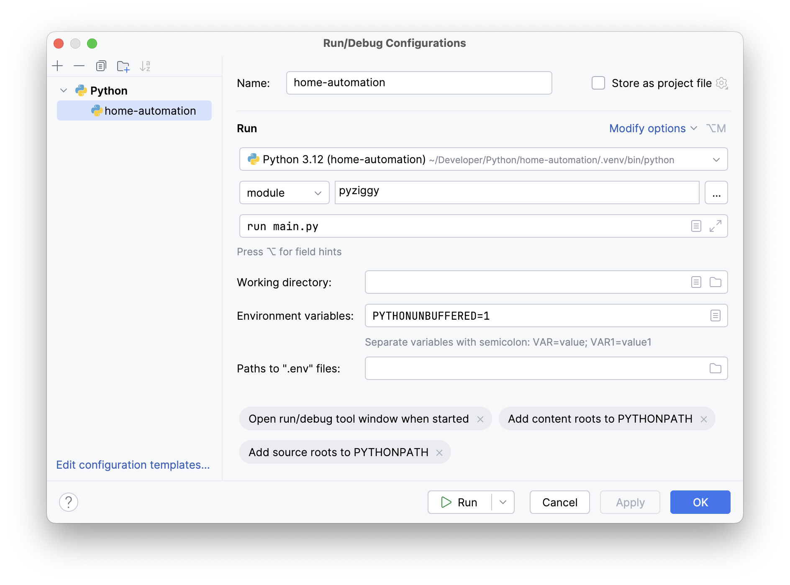

## Prerequisites

Pyenv and rsync 3.2+.

`brew install pyenv rsync`

## Getting started using git
You can clone this repository and then run `./pyziggy-setup setup` in the project directory to set up a Python virtual environment and install the required dependencies.

## Or bootstrapping the project directly from the home automation server

This approach will not initialize a git repository in your project directory.

1. Create a directory where you want to have the home automation project.
2. Download `remote.json` and `pyziggy-setup` into that directory. Make sure the latter is executable.
3. Run `./pyziggy-setup sync-remote stop`. This downloads all project files from the server and stops the pyziggy service running there. This is to ensure that the remote service does not interfere with running the project locally.
4. Run `./pyziggy-setup setup`. This will set up a Python virtual environment and install the required dependencies.

Once you're done with the modifications, you can run `./pyziggy-setup sync-remote start main.py` to upload all modified files to the server and start the service again.

## How to debug the project

You can open the project directory in Pycharm. You should use the interpreter that was created by `pyziggy-setup` in the `.venv` directory. PyCharm should offer this by default.

Create the following run configuration for debugging:

You can use the same arguments that you would with the `pyziggy run` command-line subcommand e.g. `--verbose` for logging more information.

## Switching between deployment and development

`./pyziggy-setup sync-remote start main.py` to upload the project to the server and start the service.

`./pyziggy-setup sync-remote stop` to download project files from the server and stop the service.
